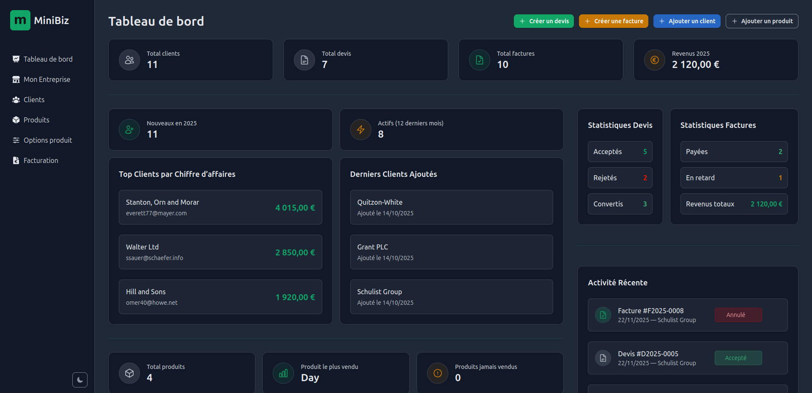
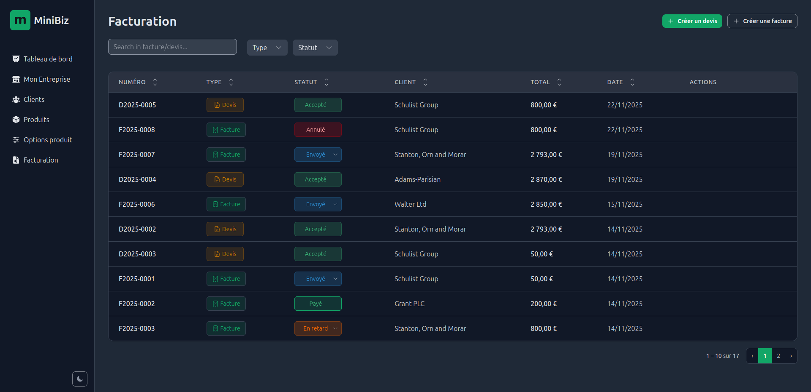
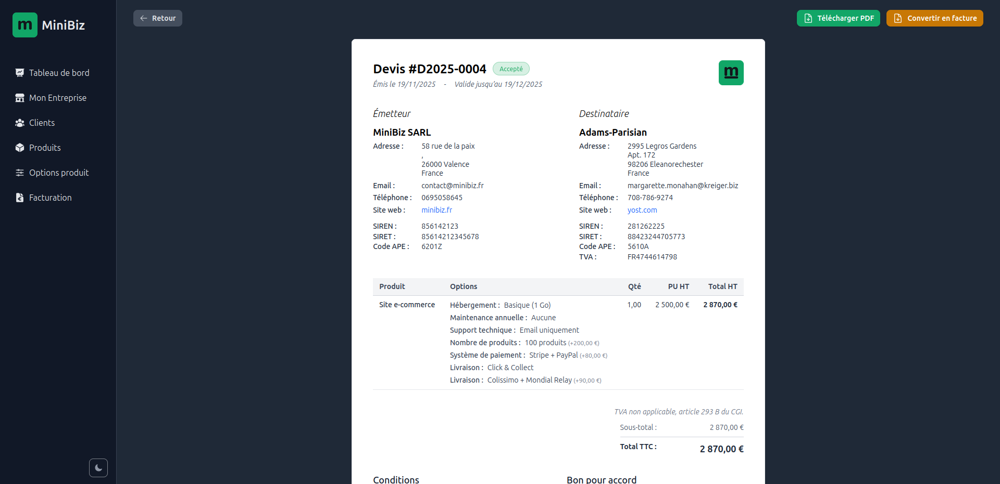
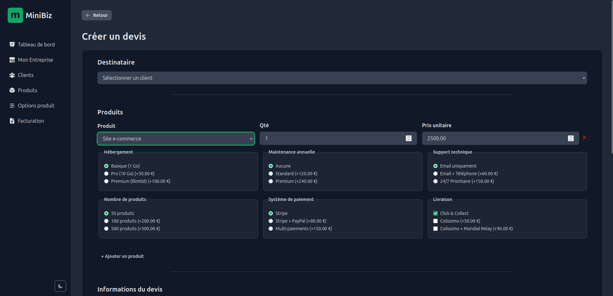
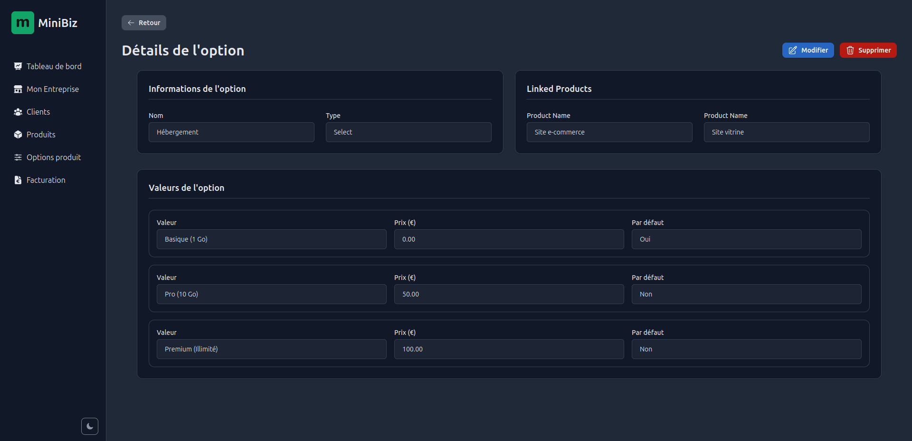
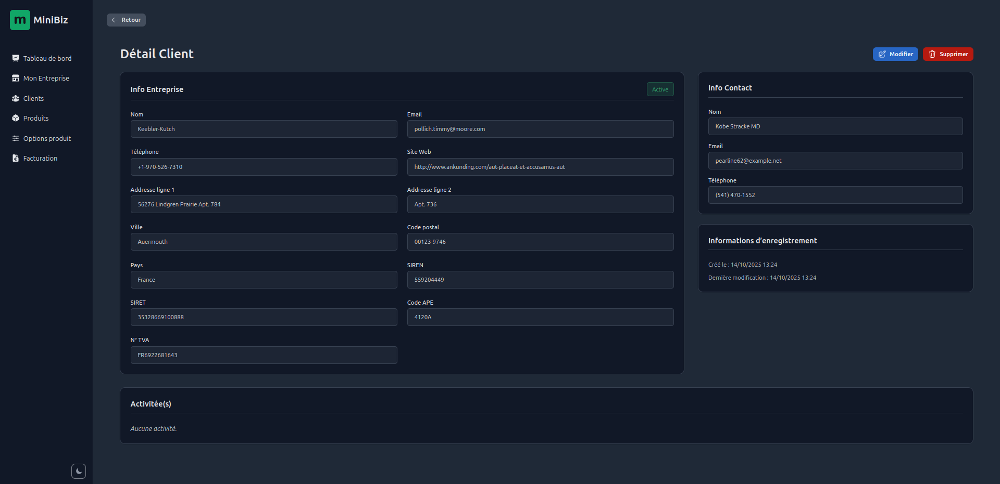
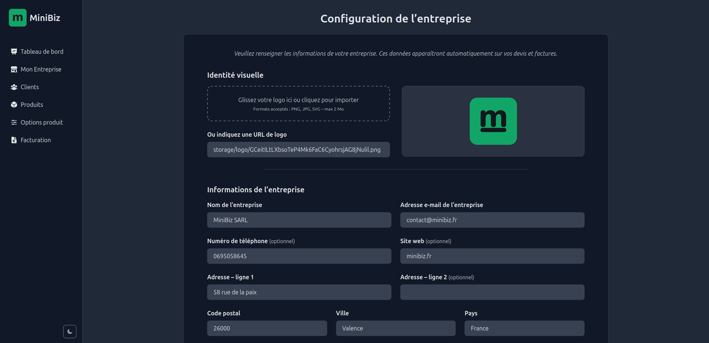

# MiniBiz — Freelance ERP

A simple, fast and modern ERP built for french freelancers.  
Manage quotes, invoices, customers and products — with advanced product options for more flexible, complete and modern workflows.

> 📄 Looking for another language?

-   🇫🇷 Read the **French README**: [`README_fr.md`](./README_fr.md)

## Introduction

**MiniBiz** is a lightweight yet powerful ERP built specifically for freelancers.  
It provides all the essential tools needed to manage daily business operations: clients, products, quotes, invoices, and advanced product options to build flexible and modern billing flows.

### Who is it for?

MiniBiz is designed for **freelancers**, **independent contractors**, and **solo entrepreneurs** who want a clean, fast, self-hostable alternative to bloated or limited ERP tools.

### What problem does it solve?

Freelancers often struggle with tools that are:

-   too limited,
-   too expensive,
-   too complex,
-   or not customizable enough.

MiniBiz solves this through:

-   a modern and clear interface,
-   structured billing flows (quotes → invoices),
-   advanced product options for detailed offers,
-   full control over your data,
-   and a codebase that is simple to extend.

### Tech Stack

#### Backend

-   **PHP 8.2+**
-   **Laravel 12**
-   **Blade Components**
-   **Spatie Browsershot** (PDF generation through headless Chrome)
-   **SQLite** or **MySQL** depending on your environment

#### Frontend

-   **TailwindCSS v4**
-   **Vite**
-   **Blade Heroicons** (via blade-ui-kit/blade-heroicons)

## Installation

### 1. Clone the repository

(backtick)bash  
git clone https://github.com/your-username/minibiz.git  
cd minibiz  
(backtick)

### 2. Install backend dependencies

(backtick)bash  
composer install  
(backtick)

### 3. Install frontend dependencies

(backtick)bash  
npm install

# or

pnpm install  
(backtick)

### 4. Configure the environment

(backtick)bash  
cp .env.example .env  
(backtick)

Generate the application key:
(backtick)bash  
php artisan key:generate  
(backtick)

### 5. Configure the database (MySQL)

MiniBiz uses **MySQL** by default.

1. Create a MySQL database (from your client or CLI), for example:
   (backtick)sql  
   CREATE DATABASE minibiz CHARACTER SET utf8mb4 COLLATE utf8mb4_unicode_ci;  
   (backtick)

2. Update the database section in your `.env` file:
   (backtick)env  
   DB_CONNECTION=mysql  
   DB_HOST=127.0.0.1  
   DB_PORT=3306  
   DB_DATABASE=minibiz  
   DB_USERNAME=your_mysql_user  
   DB_PASSWORD=your_mysql_password  
   (backtick)

If you want to use another database system (SQLite, PostgreSQL, etc.), please refer to the official Laravel documentation:  
https://laravel.com/docs/database

### 6. Run migrations

(backtick)bash  
php artisan migrate  
(backtick)

### 7. Start the development servers

#### Option A — Classic

(backtick)bash  
php artisan serve  
npm run dev  
(backtick)

#### Option B — All-in-one (recommended)

(backtick)bash  
composer dev  
(backtick)

You can now access the app at:  
👉 http://localhost:8000

## Features

MiniBiz provides a complete yet lightweight set of tools designed specifically for freelancers.  
Its goal is to offer a simple, modern and flexible ERP without the complexity of traditional business software.

### 🔹 Quotes & Invoices

-   Create professional **quotes** and **invoices**
-   Smooth workflow: **convert** a quote into an invoice
-   All invoice/quote **statuses** handled (draft, sent, accepted, rejected, converted, paid, overdue, etc.)
-   Automatic number generation for quotes and invoices

### 🔹 Advanced Product Options

Create richer and more modern offers thanks to flexible product options:

-   **Checkbox options**
-   **Single-choice options**
-   **Numeric options (qty, custom values)**
-   Options appear directly on quotes & invoices and adjust totals dynamically

Perfect for detailed services, packages or tailored offers.

### 🔹 Customers Management

-   Create & manage customer profiles
-   View all quotes/invoices related to a customer
-   Customer activity timeline (recent documents, status changes, etc.)

### 🔹 Products & Services

-   Manage your products/services catalog
-   Attach options to your products
-   Product pricing handled automatically within billing

### 🔹 PDF Export

-   Beautiful and clean PDF export
-   Powered by **Spatie Browsershot** (Chrome headless)
-   Logos, totals, taxes, options, formatting — everything is respected

### 🔹 Company Settings

-   Set your business information (SIREN, SIRET, APE/NAF code…)
-   Upload your logo
-   Configure VAT, payment terms, and all legal mentions

### 🔹 Modern UI / UX

-   Built with **TailwindCSS v4**
-   Clean and consistent Blade components
-   Responsive layout
-   Smooth interactions powered by Alpine.js

### 🔹 Self-hosted & Extendable

-   100% under your control
-   Easy to customize (Laravel structure)
-   Local-friendly (SQLite or MySQL)

MiniBiz aims to stay simple, fast, and fully focused on freelancer needs.

## Screenshots

Here are some previews of MiniBiz's interface.

### 📊 Dashboard Overview

### 🧾 Quotes & Invoices List

### 💼 Invoice / Quote View

### 🧾 Create Quote

### 🧩 Product Options

### 👤 Customer Details

### 📝 Company Settings

## Usage

MiniBiz is designed to make a freelancer’s daily workflow simple and efficient.  
Here is a typical usage flow:

### 1. Create a Customer

Add a new client with their company information, address, and contact details.

### 2. Create Products and Options

Define your services or products, and attach advanced options  
(checkboxes, single-choice, numeric values) for flexible offers.

### 3. Create a Quote

Generate a professional quote:

-   add lines,
-   attach product options,
-   totals are calculated automatically.

### 4. Send the Quote

When the quote is ready, simply **download the PDF**.  
MiniBiz will automatically update its status to **sent**.

### 5. Convert the Quote → Invoice

When the client confirms the quote, convert it into an invoice.

The quote will automatically move to the **accepted** status.  
Then choose the appropriate **payment method** for the invoice.

Once the invoice is ready, **download the PDF** to send it to the client:  
the document will automatically update to the **sent** status.

### 6. Export PDF

Export a clean PDF for the client using the Browsershot engine.

### 7. Manage Status

Track your invoices:

-   draft
-   sent
-   accepted
-   rejected
-   converted
-   paid
-   overdue

MiniBiz gives freelancers a smooth, modern, and fast billing experience.

## License

MiniBiz is released under the **MIT License**.  
You are free to use, modify, and adapt it according to your needs.

## About

MiniBiz was created as a personal tool to manage my own freelance activity.  
It is also part of my developer portfolio, showcasing a complete Laravel/Tailwind project with real-world use.

A few colleagues and freelancers use it daily for their business needs.

## Planned Improvements

Here are some improvements planned for future versions of MiniBiz:

### 🔹 Upload signed quotes

Allow users to **upload a signed quote** (PDF or image) to replace the “accepted” status.  
This will let freelancers keep an official signed document directly attached to the quote.
